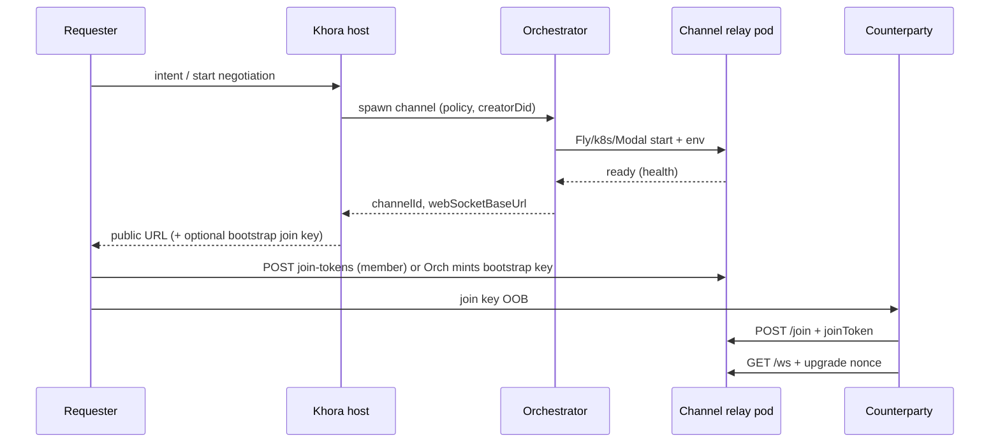

# Channel orchestrator contract

How an **orchestrator** (future Vellum spawn service, or Khora host calling Fly/k8s/Modal) provisions **single-channel relay containers** and hands credentials to participants out of band.

Relay behavior: [`channel-relay-deployment.md`](channel-relay-deployment.md). In-container APIs: [`channel-control-protocol.md`](channel-control-protocol.md).

---

## Roles

| Role | Responsibility |
|------|----------------|
| **Orchestrator** | Spawn/destroy container; set policy env; return public URL; **distribute join keys** to intended principals (join policy lives here) |
| **Channel relay container** | One `channel_id`; multiplex + spool; enforce roster/chain limits; **mint** join/attach keys via HTTP when members ask |
| **Khora** | Discovery + “open negotiation” intent; calls orchestrator; returns **public relay URL** (and optionally join key) to requester — does not host multiplex bytes |
| **Participant daemon** | DID-signed control plane + WS attach to relay URL |



---

## Orchestrator → runtime (spawn)

Each container receives **fixed env** (see relay README). Orchestrator generates or accepts `channel_id`.

| Env | Required | Description |
|-----|----------|-------------|
| `VELLUM_CHANNEL_ID` | yes | UUID for this instance |
| `VELLUM_CHANNEL_CREATOR_DID` | yes | Bootstrap roster member |
| `VELLUM_CHANNEL_TTL_MS` | no | Default 24h; cap 7d |
| `VELLUM_MAX_POPULATION` | no | Roster cap; omit = unlimited |
| `VELLUM_MAX_CHAINS` | no | JSON — `{"mode":"principal","measure":8}` or `{"mode":"global","measure":N}` |
| `VELLUM_SQLCIPHER_KEY` | yes (prod) | DB encryption |
| `VELLUM_PUBLIC_BASE_URL` | yes (prod) | Public `wss://` origin (Fly app URL, ingress host) |
| `PORT` | no | Default 8790 |

Setting `VELLUM_CHANNEL_ID` enables **single-channel mode** automatically (`VELLUM_RELAY_MODE=single` is optional explicit override). `POST /v1/channels` returns **501**.

Orchestrator should wait for `GET /health` → `200` with JSON `{ ok: true, version: 1 }` before returning URL to Khora.

---

## Orchestrator → Khora (response)

Minimal handoff when Khora discovery notifies a peer of a Vellum-provisioned channel:

```json
{
  "channelId": "550e8400-e29b-41d4-a716-446655440000",
  "webSocketUrl": "wss://vellum-relay-abc.fly.dev/v1/channels/550e8400-e29b-41d4-a716-446655440000/ws",
  "relayControlBaseUrl": "https://vellum-relay-abc.fly.dev",
  "expiresAtMs": 1710000000000,
  "bootstrapJoinToken": null
}
```

| Field | Notes |
|-------|-------|
| `webSocketUrl` | Path only — attach uses upgrade nonce, not query secrets |
| `relayControlBaseUrl` | For `VellumChannelClient` / CLI against this pod |
| `bootstrapJoinToken` | Optional single-use key orchestrator pre-minted via member API or first `join-tokens` call on creator's behalf |

Khora does **not** persist pairing secrets. It may emit a `negotiation_invite` notification with `relayControlBaseUrl` + `channelId` (see [`khora-vellum-separation.md`](../../.brain/technical/khora-vellum-separation.md)).

---

## Join policy (orchestrator-owned)

The relay does **not** decide who should negotiate. Orchestrator / Khora:

1. Chooses which principals receive `bootstrapJoinToken` or subsequent `joinToken` values.
2. May cap invitations off-platform (one peer, N peers) before minting tokens.
3. Relies on relay to enforce **technical** limits: `maxPopulation`, `maxChains`, chain allocate rules.

In-container key APIs (member-gated):

| API | Purpose |
|-----|---------|
| `POST /v1/channels/:id/join-tokens` | Mint single-use roster join token |
| `POST /v1/channels/:id/ws-nonce` | Mint one-time multiplex attach nonce |
| `POST /v1/channels/join` | Redeem join token (any holder with DID auth) |

---

## Destroy

Orchestrator stops container when `expiresAtMs` elapses or negotiation completes. DAG state remains on participant devices; rejoin uses future DAG descriptor + new container (see separation doc P5).

---

## Implementation status

| Piece | Status |
|-------|--------|
| Single-channel relay boot (`VELLUM_CHANNEL_ID`) | **Done** in `apps/vellum/channel-relay` |
| `POST .../join-tokens` | **Done** |
| Pool mode (`VELLUM_RELAY_MODE=pool` or no channel id) | Dev / CI |
| Orchestrator service | **Not implemented** — Khora still uses pool or local relay for dev |
| Fly/k8s/Modal manifests | **Not in repo** — operator supplies from env contract above |
