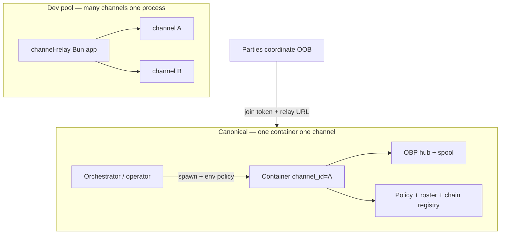

# Channel relay deployment architecture

How Vellum **byte relay** is deployed relative to **channel control** (roster, limits, chain slots). Normative wire behavior for limits and allocation remains in [`channel-control-protocol.md`](channel-control-protocol.md). Event ordering: [`.brain/technical/channel-lifecycle.md`](../../.brain/technical/channel-lifecycle.md).

---

## Two deployment profiles

| Profile | Processes | Channel count | Join model | Status |
|---------|-----------|---------------|------------|--------|
| **Single-channel container** (canonical) | One relay container ↔ one `channel_id` | Exactly **1** | Out-of-band **single-use join token** | **Target** for production / ephemeral infra |
| **Multi-tenant relay pool** (dev) | One long-lived Bun process | Many (`VELLUM_RELAY_MAX_CHANNELS`) | `invite_only` via join token | **Current** [`apps/vellum/channel-relay`](../../apps/vellum/channel-relay) reference |

Both profiles share the same **data plane** (`relay-server-http`: channel admission tickets, opaque blob spool, WS multiplex) and the same **enforcement semantics** for roster size, chain quotas, and bilateral allocation. They differ in **how many channels live in one OS process**. OBP wire contract: `@khoralabs/obp-frame-relay-spec`.

---

## Canonical: single-channel container

### Intent

Parties agree **out of band** who is negotiating and who runs the relay. One party (or an orchestrator) starts a container whose **only job** is:

1. Hold one nonce-gated **multiplex** (`channel_id` fixed at boot).
2. Buffer and fan-out **opaque frames** (OBP hub policy).
3. Enforce **channel policy** on this instance: roster cap, per-member chain quotas, bilateral chain slots.

The container is **not** a discovery host, catalog, or multi-tenant SaaS. "Who may participate" reduces to: **whoever received a single-use join token** (and, for control-plane actions after join, whoever can sign HTTP as their DID).

### Boot model

| Input | Source | Role |
|-------|--------|------|
| `VELLUM_CHANNEL_ID` | Orchestrator | Fixed UUID for life of container |
| `VELLUM_CHANNEL_TTL_MS` | Orchestrator | Container / admission expiry |
| `maxPopulation` | Spawn config (env / manifest) | Optional roster cap |
| `maxChains` | Spawn config | `global` / `principal` |
| Creator DID | First roster member (bootstrap) | Operator or initiating principal |

On boot the process:

- Calls `hub.createChannel(channel_id, ttl)` once (spool + pairing secret).
- Seeds registry with **creator** on roster and frozen policy.
- Exposes HTTP + WS for **that** `channel_id` only (paths may omit `:id` in a slim binding, or `:id` must match env).

### Join = single-use token distribution (only mechanism)

There is **no** open join and **no** join-request queue in this profile.

| Step | Actor | Action |
|------|-------|--------|
| 1 | Roster member (typically creator) | `POST .../join-tokens` → receives high-entropy **single-use join token** |
| 2 | Operator / member | Distributes token **out of band** (Signal, inbox, QR, orchestrator secret store) |
| 3 | Recipient | `POST .../join` with `{ joinToken }` + DID-signed HTTP → added to roster (subject to `maxPopulation`) |
| 4 | Recipient | Response includes `webSocketUrl` + `upgradeNonce` for multiplex attach |

**Admission rule:** possession of a valid, unconsumed join token **is** the admission proof for roster entry. Distribution policy is entirely outside the relay ("whoever you gave the key to").

Re-attach for existing members: `POST .../ws-nonce` (member + DID auth) → one-time upgrade nonce. No new roster slot.

### What stays enforced (unchanged semantics)

These are **relay-local policy** on the single channel, not multi-tenant concerns:

| Policy | Enforced on |
|--------|-------------|
| **`maxPopulation`** | Join token redeem (new roster principal) |
| **`maxChains` global** | `POST .../chains/allocate` (active slot count) |
| **`maxChains` principal** | Per-member `chain_quota` on join + allocate |
| **Bilateral chains** | Allocate requires two distinct roster DIDs; daemon `chain/init` checks slot |
| **WS attach** | One-time upgrade nonce; **not** a roster join |

### Orchestrator responsibilities (outside the container)

- Spawn / destroy container (Fly, Modal, k8s Job, etc.).
- Pass policy env and public `wss://` URL back to parties OOB.
- Optionally mint bootstrap join tokens before handing URLs to participants.
- **Not** required: shared SQLite across channels, relay-wide channel listing, or Khora-style discovery.

### Threat model notes

- **Blast radius:** one channel per container limits spool DoS and CPU to one negotiation.
- **No cross-tenant leakage:** no second `channel_id` in process.
- **Join token secrecy:** security depends on OOB distribution (same as sharing a channel join token).
- **Post-join control plane:** DID-signed HTTP still required for allocate / release / ws-nonce (membership gate).

---

## Multi-tenant relay pool (reference / dev)

[`apps/vellum/channel-relay`](../../apps/vellum/channel-relay) can run as a **pool**:

- `POST /v1/channels` creates new `channel_id` rows until `VELLUM_RELAY_MAX_CHANNELS`.
- SQLCipher registry holds many channels, members, invites, chain slots.
- Admission: `invite_only` via join token (same as canonical).

### Why it exists

- Local development: one `bun run` exercises many channels.
- Optional future **shared public relay** SKU (operator wants one hostname, many ephemeral channels).
- Reference implementation while the Vellum control plane and relay repo were integrated.

### Why it is not canonical for Vellum

Combines **orchestration** (spawn many channels) with **relay** (multiplex one stream) in one process. That drove extra audit surface (per-channel isolation, WS connection caps, unbounded spool × N channels) without serving the original "one negotiation → one ephemeral relay" model.

**Recommendation:** treat the pool as a **dev** deployment; implement production orchestration against the **single-channel container** contract.

| Pool feature | Single-channel replacement |
|--------------|---------------------------|
| `POST /v1/channels` | Orchestrator spawns new container |
| `VELLUM_RELAY_MAX_CHANNELS` | Per-orchestrator quota on container count |
| Shared `VELLUM_RELAY_DB_PATH` | One DB file per container (or `:memory:`) |

---

## Layering (both profiles)

| Layer | Package / doc | Responsibility |
|-------|---------------|----------------|
| **OBP frame relay** | `@khoralabs/obp-frame-relay` | Pairing secret, spool, hub fan-out, `RelayEnvelope` |
| **Channel control** | This repo + [`channel-control-protocol.md`](channel-control-protocol.md) | Roster, limits, chain slots, join/attach credentials |
| **Orchestrator** | External (future `vellum spawn` API) | Create container, return URL + tokens OOB — see [`channel-orchestrator-contract.md`](channel-orchestrator-contract.md) |
| **NBC / daemon** | `apps/vellum/daemon` | Local DAG; `chain/init` after allocate |

The **multiplex** is not a "channel hub" product object. OBP **hub** = stamping policy on one stream ([`hub-protocol.smithy`](../../obp/frame-relay/spec/model/hub-protocol.smithy)).

---

## HTTP surface (canonical profile)

| Method | Path | Purpose |
|--------|------|---------|
| POST | `/v1/channels/join` | Redeem **single-use join token** → roster + attach creds |
| POST | `/v1/channels/:id/join-tokens` | Member mints join token for OOB distribution |
| POST | `/v1/channels/:id/ws-nonce` | Member mints upgrade nonce (re-attach) |
| GET | `/v1/channels/:id/ws` | Multiplex attach (`Sec-WebSocket-Protocol: vellum.nonce.<nonce>`) |
| POST | `/v1/channels/:id/chains/allocate` | Bilateral chain slot |
| GET | `/v1/channels/:id/chains/:sessionId` | Slot status (daemon gate) |
| POST | `/v1/channels/:id/chains/:sessionId/release` | Release slot |
| GET | `/health` | Liveness |

**Not in canonical profile:** `POST /v1/channels` (create), channel discovery.

Single-channel mode is implemented in the same binary via `VELLUM_CHANNEL_ID` (`POST /v1/channels` returns 501).

---

## Migration path (implementation)

1. **Document** (this file) — canonical vs pool profiles. **Done**
2. **Mode flag** — `VELLUM_CHANNEL_ID` → single; `VELLUM_RELAY_MODE=pool` or unset → pool. Single mode rejects `POST /v1/channels` (501), fixes `channel_id` from env. **Done**
3. **Join token route** — `POST .../join-tokens` for members; `POST .../join` accepts `joinToken`. **Done**
4. **Removed** open/`request_to_join` admission modes and `deferred` chain quota from relay and contracts. **Done**
5. **Orchestrator** — spawn container with policy env; return `{ relayUrl, channelId, joinToken? }` OOB. Spec: [`channel-orchestrator-contract.md`](channel-orchestrator-contract.md). **Spec only**
6. **Khora spawn integration** — host calls orchestrator, returns public URL to requester. **Not implemented**

Reference pool app: [`apps/vellum/channel-relay`](../../apps/vellum/channel-relay). OBP hub: [`packages/obp/frame-relay`](../../obp/frame-relay).
